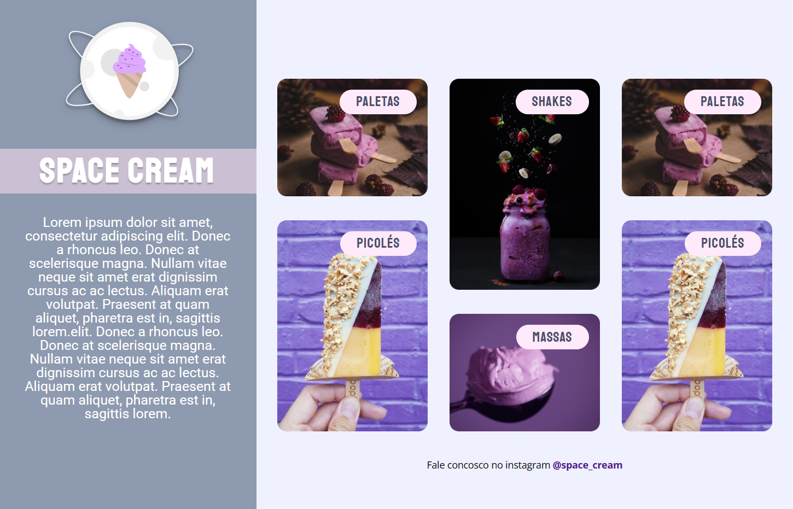

<h1 align="center">SPACE CREAM </h1>

 
 

  

 
    <a href="https://fernandoaugustodev.github.io/Space_Cream_Mobile/" target="_blank" >Veja o Projeto</a>

## 💻 Sobre o Projeto
 

Site estático onde foi aplicado estratégias de Mobile First e responsividade e animação, e display Grid

 

## 🛠 Techs

Tecnologias usadas neste projeto

✅ HTML  
✅ CSS
   - Mobile First;
   - Unidade de medida flexível;
   - variáveis CSS
   - Animações
   - Display GRID 
---

## 👨🏼‍💻 Autor

Fernando Augusto 

 
  
 
© 2023 GitHub, Inc.
Terms Privacy Security Status Docs
